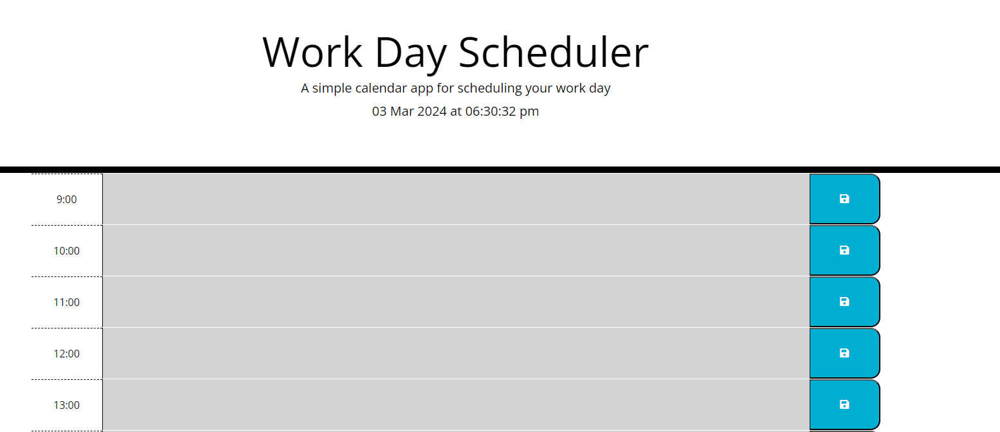

# planner-app

## Project Description

The following project includes a planner application that allows that allows a user to save events for each hour of the day by modifying starter code. This app will run in the browser and feature dynamically updated HTML and CSS powered by jQuery. This applicaiton also utilises the [Day.js](https://day.js.org/docs/en/display/format) library to work with date and time.

### Home Page

### Completed Tasks:

* Displays the current day at the top of the calender when a user opens the planner.
 
* Presents timeblocks for standard business hours when the user scrolls down.
 
* Color-codes each timeblock based on past, present, and future when the timeblock is viewed.
 
* Allows a user to enter an event when they click a timeblock

* Saves the event in local storage when the save button is clicked in that timeblock.

* Persist events between refreshes of a page.

## Installation

This single static website can be deployed either locally or to a webserver. With the included "index.html" file containing the main code for the website, and the accompanying "style.css" stylesheet and "script.js" script file. Alternatively, the website can be found on the GitHub Pages link below.

### script.js

Contains the main logic for the planner. Including:
* Setting up the canvas.
* Color coding each timeblock.
* Allows the user to enter and save a description for a timeblock.
* Retrieves previously saved timeblocks.
* Clears old descriptions from UI and local storage.

### Notes

Designed primarily for a desktop experience, the site can be accessed on small screen sizes, with a minimum screensize of 600px horizontally. Please keep this in mind when accessing the site on your device.

### GitHub Pages:

[GitHub Pages](https://sunnymudhar.github.io/planner-app/)
